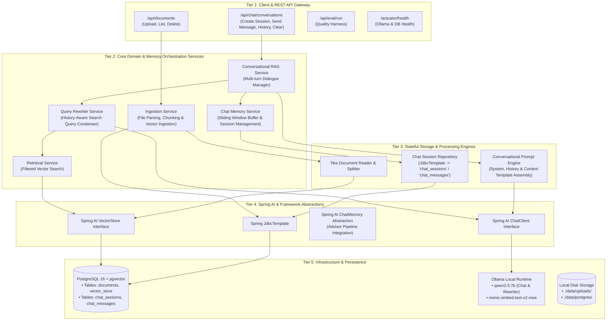
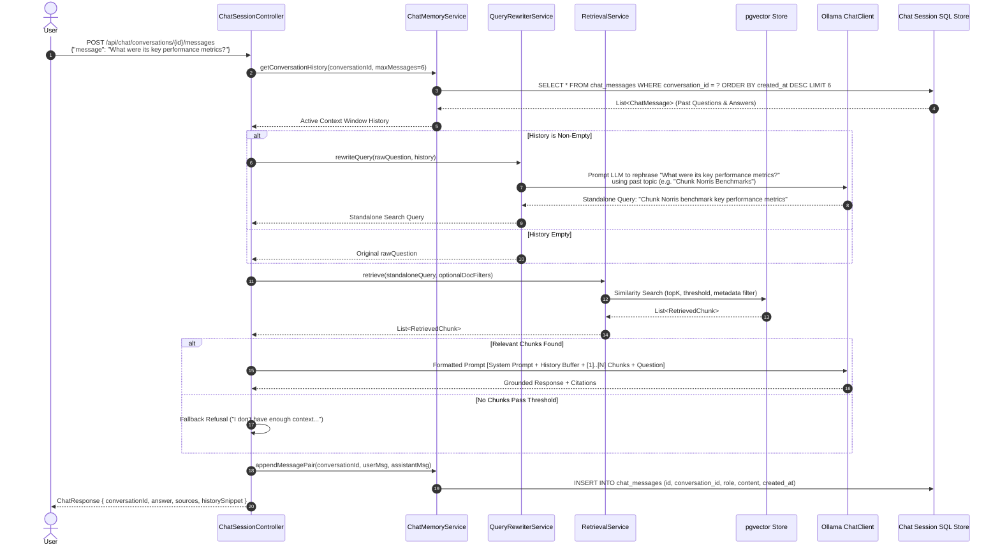

# Chunk Norris Architecture v2: Conversational RAG with Stateful Memory

## Overview

Chunk Norris v2 extends the core RAG architecture with **Stateful Multi-Turn Conversation Memory** and **Contextual Query Rewriting**. This enables interactive chat sessions where follow-up questions (e.g., *"What were its main features?"*) are dynamically re-contextualized using past conversation history before executing vector searches.

---

## 1. System Architecture Overview (with Conversation Memory)

### 1.1 Tiered Architecture with Chat Memory & Query Rewriter



---

## 2. Multi-Turn Conversational RAG Sequence Workflow



---

## 3. Database Schema Extensions for Conversation State

### 3.1 Chat Sessions Table (`chat_sessions`)
```sql
CREATE TABLE IF NOT EXISTS chat_sessions (
    id UUID PRIMARY KEY,
    title TEXT NOT NULL,
    created_at TIMESTAMPTZ NOT NULL,
    updated_at TIMESTAMPTZ NOT NULL
);
```

### 3.2 Chat Messages Table (`chat_messages`)
```sql
CREATE TABLE IF NOT EXISTS chat_messages (
    id UUID PRIMARY KEY,
    conversation_id UUID NOT NULL REFERENCES chat_sessions(id) ON DELETE CASCADE,
    role VARCHAR(20) NOT NULL, -- 'USER', 'ASSISTANT', 'SYSTEM'
    content TEXT NOT NULL,
    citations_json TEXT,       -- Serialized List<SourceReference>
    created_at TIMESTAMPTZ NOT NULL
);
CREATE INDEX IF NOT EXISTS idx_chat_messages_conv ON chat_messages(conversation_id, created_at DESC);
```

---

## 4. Module Breakdown (`{pkg}.chat.memory`)

### 4.1 `ChatSessionController.java`
- `POST /api/chat/conversations`: Initializes new chat session UUID.
- `POST /api/chat/conversations/{id}/messages`: Submits new turn, triggers rewrite $\rightarrow$ retrieve $\rightarrow$ generate $\rightarrow$ persist loop.
- `GET /api/chat/conversations/{id}/history`: Returns full transcript for frontend rendering.
- `DELETE /api/chat/conversations/{id}`: Deletes chat session and associated messages.

### 4.2 `ChatMemoryService.java`
Manages conversation buffer window (e.g. last 6-10 messages). Integrates with Spring AI's `ChatMemory` interface or implements `MessageWindowChatMemory`.

### 4.3 `QueryRewriterService.java`
Constructs a lightweight prompt instructing Ollama to condense ambiguous user follow-ups into explicit, standalone search vectors:
> *"Given the following conversation history and a follow-up question, rephrase the follow-up question to be a self-contained search query."*

### 4.4 `ConversationalRagService.java`
Coordinates history retrieval, query rewriter execution, document context injection, LLM generation, and persistent message store updates.
