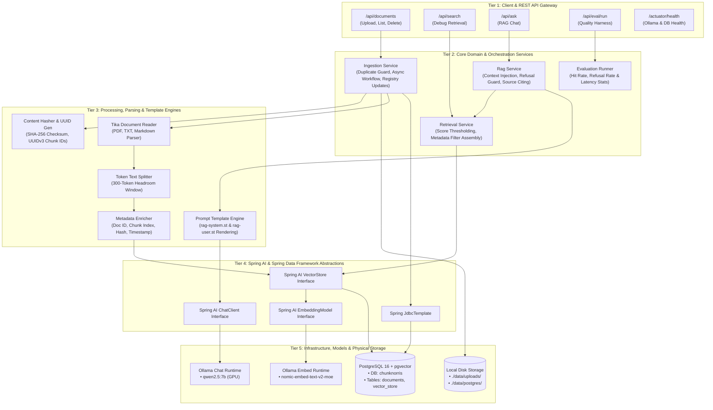
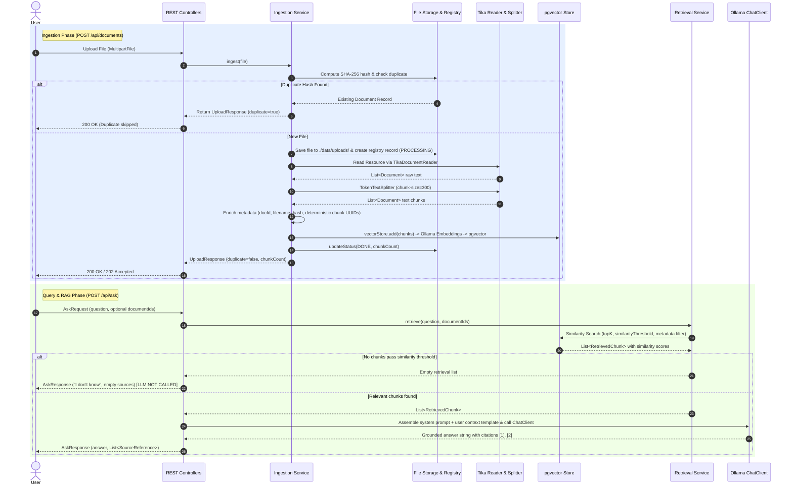
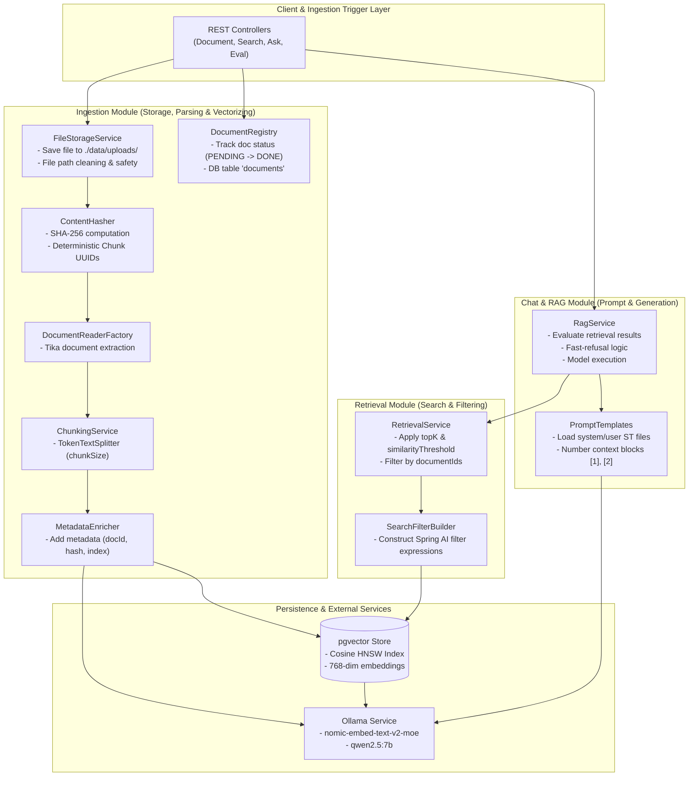
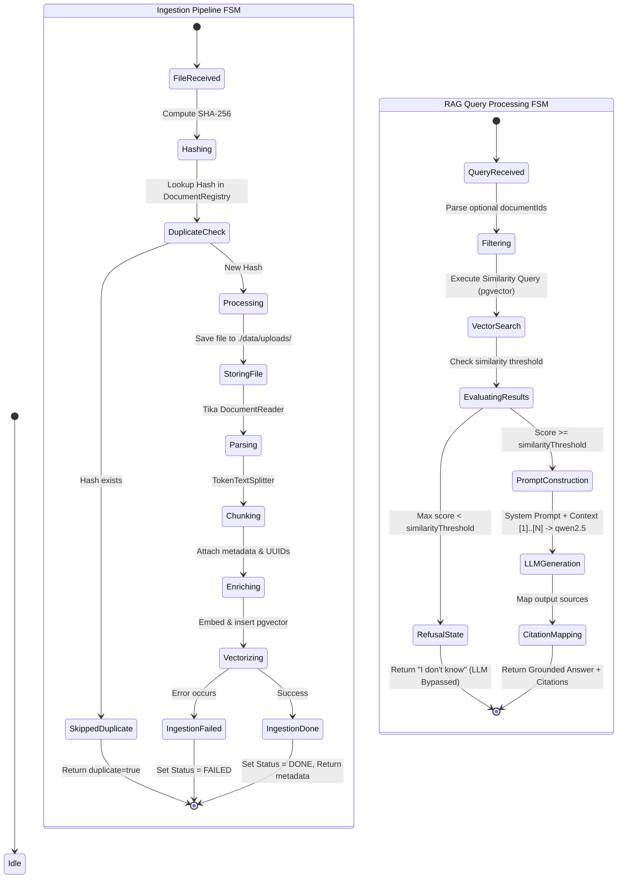

# Chunk Norris Architecture & Workflow Specification

## Overview

Chunk Norris is a zero-cost local Retrieval-Augmented Generation (RAG) system built with **Spring Boot 4.1.1 (Java 21)**, **Spring AI**, **Ollama** (`qwen2.5:7b` chat model + `nomic-embed-text-v2-moe` embedding model), and **pgvector** (`pgvector/pgvector:pg16` in Docker).

## 1. System Architecture Overview

### 1.1 Generalized Tiered Architecture (All Key Modules)



### 1.2 End-to-End Sequence Diagram



### 1.2 Module Responsibilities (Box Component Diagram)



### 1.3 System Control Flow & Finite State Machine (FSM)



### 1.4 Detailed Subsystem Separation Architecture

```mermaid
graph TD
    %% Subsystem 1: REST Module
    subgraph REST_Module ["1. Spring Boot REST Module"]
        DC["DocumentController<br/>• POST /api/documents<br/>• GET /api/documents<br/>• DELETE /api/documents/{id}"]
        SC["SearchController<br/>• GET /api/search?q=... (Debug)"]
        AC["AskController<br/>• POST /api/ask"]
        EC["EvaluationController<br/>• GET /api/eval/run"]
    end

    %% Subsystem 2: Ingestion System
    subgraph Ingestion_System ["2. Spring Boot Ingestion System"]
        IS["IngestionService<br/>(Pipeline Orchestration)"]
        FSS["FileStorageService<br/>• Saves to ./data/uploads/<br/>• Path validation"]
        DR["DocumentRegistry<br/>• JdbcTemplate DB Repository<br/>• Table: 'documents'"]
        CH["ContentHasher<br/>• SHA-256 Checksum<br/>• UUID Chunk Gen"]
        DRF["DocumentReaderFactory<br/>• Tika parsing (PDF/TXT/MD)"]
        CS["ChunkingService<br/>• TokenTextSplitter (size 300)"]
        ME["MetadataEnricher<br/>• docId, hash, index tags"]
    end

    %% Subsystem 3: RAG Chat AI Engine
    subgraph RAG_Chat_AI ["3. RAG Chat AI Engine"]
        RS["RagService<br/>(RAG Flow Orchestration)"]
        RETS["RetrievalService<br/>• Queries VectorStore<br/>• Similarity thresholding"]
        SFB["SearchFilterBuilder<br/>• documentId filter logic"]
        PT["PromptTemplates<br/>• System & User .st templates<br/>• Context numbering [1]..[N]"]
        CC["Spring AI ChatClient<br/>(Configured Ollama Bean)"]
    end

    %% Subsystem 4: Embedding Model Subsystem
    subgraph Embedding_Model ["4. Embedding Model Subsystem"]
        OEM["Ollama Embedding Model<br/>• nomic-embed-text-v2-moe<br/>• 768-Float Vector Generator"]
    end

    %% Subsystem 5: Vector DB Subsystem
    subgraph Vector_DB ["5. Vector DB Subsystem (pgvector)"]
        VS["Spring AI VectorStore<br/>(Abstractions & Queries)"]
        PGV_DB[("PostgreSQL + pgvector<br/>• Table: vector_store<br/>• HNSW Cosine Index")]
    end

    %% Subsystem 6: External LLM Service
    subgraph LLM_Service ["6. Ollama Local LLM"]
        QWEN["qwen2.5:7b Chat Model<br/>(Native Windows / GPU)"]
    end

    %% --- Connections & Data Flows ---

    %% Ingestion Flow Connections
    DC -->|1. Multipart File| IS
    IS -->|2. Raw Bytes| CH
    CH -->|3. Check SHA-256| DR
    IS -->|4. Store Original| FSS
    IS -->|5. Save Meta (PROCESSING)| DR
    IS -->|6. File Path| DRF
    DRF -->|7. Raw Text Docs| CS
    CS -->|8. Token Chunks| ME
    ME -->|9. Enriched Chunks| VS
    VS -->|10. Text for Vectorization| OEM
    OEM -->|11. 768-dim Embeddings| VS
    VS -->|12. SQL Batch Insert| PGV_DB
    IS -->|13. Mark Status DONE| DR

    %% Search & Debug Connections
    SC -->|Direct Vector Query| RETS

    %% RAG / Chat Flow Connections
    AC -->|1. AskRequest (Question + DocIDs)| RS
    RS -->|2. Retrieve Chunks| RETS
    RETS -->|3. Build Filters| SFB
    SFB -->|4. Filtered Query| VS
    VS -->|5. Embed Query Text| OEM
    OEM -->|6. Query Vector| VS
    VS -->|7. Similarity Search| PGV_DB
    PGV_DB -->>|8. Top-K Chunks + Scores| VS
    VS -->>|9. List<Document>| RETS
    RETS -->>|10. List<RetrievedChunk>| RS
    
    RS -->|11. Fast-Refusal Check| RS
    RS -->|12. Render Prompts & [1] Context| PT
    PT -->|13. Formatted Prompt| CC
    CC -->|14. Inference Request| QWEN
    QWEN -->>|15. Generated Answer String| CC
    CC -->>|16. Answer Text| RS
    RS -->|17. AskResponse (Answer + Sources)| AC
```

---

## 2. Component Architecture & Package Breakdown

Package root: `github.mralmostcool.chunk_norris`

### 2.1 Configuration Layer (`{pkg}.config`)
- **`RagProperties.java`**: Strongly-typed `@ConfigurationProperties(prefix = "rag")` holding system parameters (`chunkSize`, `topK`, `similarityThreshold`, `uploadDir`).
- **`ChatClientConfig.java`**: Configures the Spring AI `ChatClient.Builder` bean connected to local Ollama chat model.

### 2.2 Ingestion Module (`{pkg}.ingestion`)
Handles physical storage, parsing, chunking, hashing, metadata enrichment, and database tracking.
- **`DocumentController.java`**: REST endpoints (`POST /api/documents`, `GET /api/documents`, `DELETE /api/documents/{id}`) for file management.
- **`IngestionService.java`**: Orchestrates duplicate detection, storage, reading, chunking, metadata enrichment, vector indexing, and status updates.
- **`FileStorageService.java`**: Manages physical file persistence in `./data/uploads/`, filename sanitization, and file deletion.
- **`DocumentReaderFactory.java`**: Wraps Spring AI `TikaDocumentReader` to extract raw structured text `Document` objects from PDF, MD, TXT files.
- **`ChunkingService.java`**: Uses `TokenTextSplitter` configured via `RagProperties.chunkSize` to break raw documents into model-safe token blocks.
- **`ContentHasher.java`**: Generates SHA-256 byte hashes and deterministic `UUID` chunk identifiers via `UUID.nameUUIDFromBytes`.
- **`MetadataEnricher.java`**: Attaches standard audit and tracking keys (`documentId`, `filename`, `chunkIndex`, `fileHash`, `uploadedAt`) to each chunk.
- **`DocumentRegistry.java`**: Plain `JdbcTemplate` repository interacting with `documents` SQL table to track processing status (`PENDING`, `PROCESSING`, `DONE`, `FAILED`).

### 2.3 Retrieval Module (`{pkg}.retrieval`)
Isolates semantic vector search from LLM generation.
- **`SearchController.java`**: Debug endpoint (`GET /api/search?q=...`) to test pure vector retrieval without invoking LLM.
- **`RetrievalService.java`**: Queries `VectorStore` using `topK` and `similarityThreshold`. Optionally applies metadata filters when specific `documentIds` are provided.
- **`SearchFilterBuilder.java`**: Constructs Spring AI metadata filter expressions for `documentId in [...]`.

### 2.4 Chat & RAG Module (`{pkg}.chat`)
Handles prompt generation, grounded reasoning, citation mapping, and endpoint execution.
- **`AskController.java`**: Main REST API (`POST /api/ask`) accepting questions and optional document scope filters.
- **`RagService.java`**: Executes RAG workflow: calls `RetrievalService`, formats chunk context into numbered blocks `[1]`, constructs prompt via `PromptTemplates`, invokes `ChatClient`, and attaches `SourceReference` list.
- **`PromptTemplates.java`**: Loads and compiles external StringTemplate files (`prompts/rag-system.st`, `prompts/rag-user.st`).

### 2.5 Evaluation Module (`{pkg}.evaluation`)
Quantifies RAG performance.
- **`EvaluationController.java`**: Exposes `/api/eval/run` to trigger batch testing against `eval/questions.json`.
- **`EvaluationRunner.java`**: Measures hit rate, refusal accuracy, and latency.

### 2.6 Health & Infrastructure (`{pkg}.common`)
- **`GlobalExceptionHandler.java`**: `@RestControllerAdvice` mapping domain exceptions (`UnsupportedFileTypeException`, `DocumentNotFoundException`) to RFC 7807 `ProblemDetail`.
- **`OllamaHealthIndicator.java`**: Custom Spring Boot Actuator health check pinging local Ollama service.

---

## 3. Data Schema & Persistence

### 3.1 Document Registry Table (`documents`)
```sql
CREATE TABLE IF NOT EXISTS documents (
    id UUID PRIMARY KEY,
    filename TEXT NOT NULL,
    file_hash TEXT UNIQUE NOT NULL,
    status TEXT NOT NULL,
    chunk_count INT DEFAULT 0,
    stored_path TEXT NOT NULL,
    uploaded_at TIMESTAMPTZ NOT NULL
);
```

### 3.2 Vector Store Table (`vector_store`)
Managed automatically by Spring AI pgvector integration:
- `id`: UUID (Deterministic from file hash + chunk index)
- `content`: TEXT (chunk text snippet)
- `metadata`: JSONB (`documentId`, `filename`, `chunkIndex`, `fileHash`, `uploadedAt`)
- `embedding`: VECTOR(768) (`nomic-embed-text-v2-moe`) with Cosine distance index (HNSW).

---

## 4. Module Inter-Communication & Flow Rules

1. **Ingestion Loop**:
   `DocumentController` -> `IngestionService` -> `FileStorageService` & `DocumentRegistry` -> `DocumentReaderFactory` -> `ChunkingService` -> `MetadataEnricher` -> `VectorStore`
2. **Idempotency Rule**:
   If `ContentHasher.sha256(file)` matches an existing entry in `DocumentRegistry`, ingestion halts immediately and returns `duplicate: true`.
3. **Retrieval Refusal Rule**:
   If `RetrievalService` finds no chunks meeting `rag.similarity-threshold`, `RagService` returns fixed refusal message immediately without calling Ollama (saves GPU compute).
4. **Citation Contract**:
   Every context chunk supplied to LLM is tagged `[1]`, `[2]`. System prompt enforces returning bracketed citations matching items in `sources` response array.
